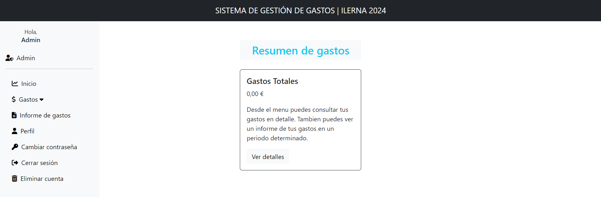

# Sistema de Gestión de Gastos

Este proyecto es una aplicación web desarrollada como proyecto final para el curso de Desarrollo de Aplicaciones Web (DAW).

## Descripción

Esta aplicación permite a los usuarios gestionar sus gastos personales. Los usuarios pueden crear cuentas, administrar sus gastos (agregar, visualizar y eliminar), y eliminar su propia cuenta si lo desean. También incluye un rol de administrador con capacidades adicionales.

### Características principales

- Registro y autenticación de usuarios
- Gestión de gastos personales (agregar, visualizar, eliminar)
- Rol de administrador para gestión de usuarios y permisos
- Interfaz responsiva y amigable

## Tecnologías utilizadas

- PHP
- HTML
- Bootstrap (para estilos)
- CSS
- JavaScript (para alertas)
- MySQL (base de datos)

## Requisitos previos

- Servidor web Apache
- MySQL
- XAMPP (recomendado para entorno de desarrollo local)

## Instalación y ejecución local

1. Descarga e instala XAMPP.
2. Clona este repositorio en la carpeta `htdocs` de XAMPP: htdocs/daw_project/
3. Inicia XAMPP y activa los módulos Apache y MySQL.
4. Importa la base de datos:

- Abre phpMyAdmin (http://localhost/phpmyadmin)
- Ve a la pestaña 'SQL'
- Copia y pega el contenido del archivo `.sql` incluido en este proyecto
- Ejecuta el script SQL

5. Verifica que el puerto de MySQL en el archivo `/config/dbconnection.php` coincida con el puerto que aparece en XAMPP para MySQL.
6. Accede a la aplicación en tu navegador: http://localhost/daw_project/

## Propósito del proyecto

Este proyecto se comparte con el propósito de mostrar un ejemplo de proyecto final para el curso de DAW. Está protegido por una licencia MIT y no está permitida su redistribución o uso comercial sin autorización.

## Licencia

Este proyecto está bajo la Licencia MIT. Consulta el archivo `LICENSE` para más detalles.
